# 🌿 Plant Species Image Classification

## 📌 Project Overview
This project aims to develop an image classification model that can recognize and differentiate 20 related plant species using Google Teachable Machine. A dataset of at least 250 images per species was collected, focusing primarily on leaf-based images captured from different angles and lighting conditions to improve model accuracy and generalization.

The purpose of this model is to automatically identify plant species based on visual features such as leaf shape, vein structure, texture, and overall appearance. This demonstrates how machine learning can be applied to real-world problems in agriculture, environmental monitoring, and plant identification, while showcasing the process of dataset preparation, model training, evaluation, and deployment.

---

## 🌱 Plant Species List

### 1️⃣ Mango (*Mangifera indica*)
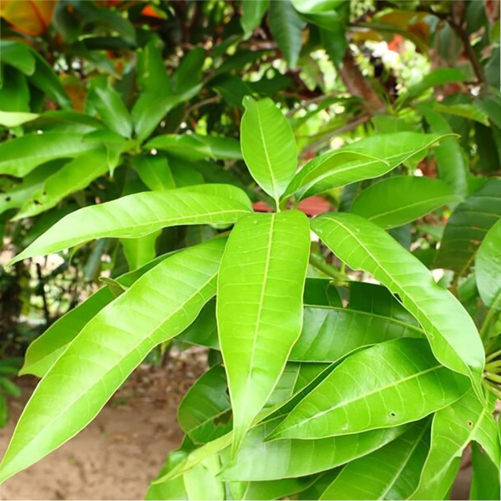

Mango is a tropical fruit-bearing tree widely cultivated in warm climates. It has long, glossy green leaves and is known for producing sweet, nutritious fruits rich in vitamins A and C.

---

### 2️⃣ Banana (*Musa acuminata*)
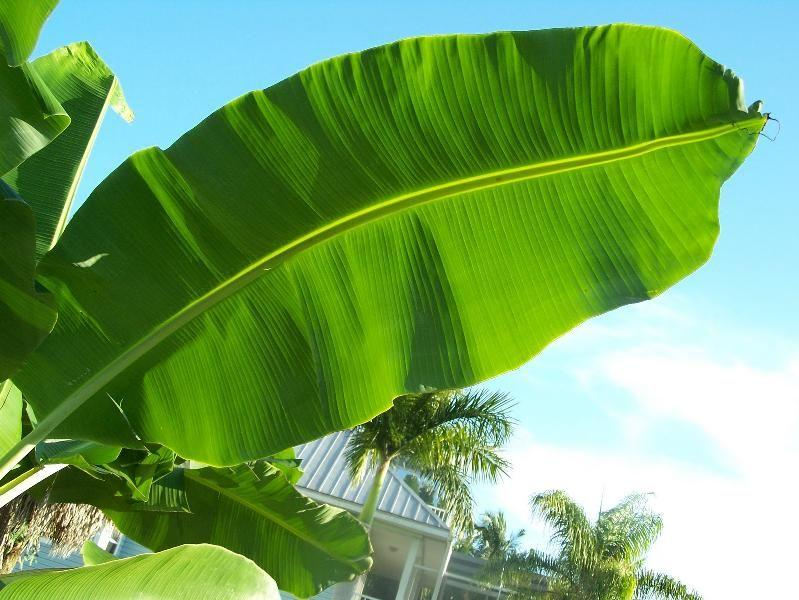

Banana is a fast-growing tropical plant characterized by large, broad leaves. It is widely cultivated for its edible fruit and is an important agricultural crop worldwide.

---

### 3️⃣ Papaya (*Carica papaya*)

Papaya is a tropical plant with deeply lobed leaves and a soft trunk. It produces sweet orange fruits and is valued for its nutritional and medicinal properties.

---

### 4️⃣ Jackfruit (*Artocarpus heterophyllus*)
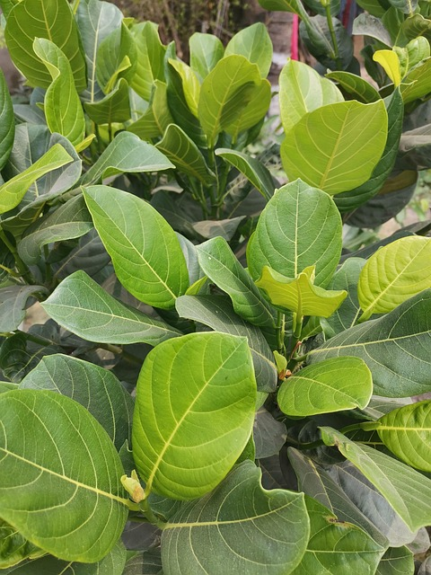

Jackfruit is a large tropical tree known for producing the biggest tree-borne fruit. Its leaves are thick, dark green, and oval-shaped.

---

### 5️⃣ Durian (*Durio zibethinus*)
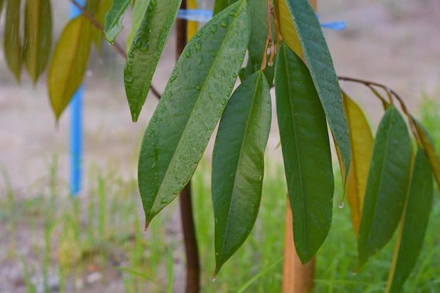

Durian is a tropical tree famous for its strong-smelling fruit. It has elongated leaves with a glossy upper surface and a golden-brown underside.

---

### 6️⃣ Rambutan (*Nephelium lappaceum*)

Rambutan is a tropical fruit tree with compound leaves and hairy red fruits. It thrives in humid environments.

---

### 7️⃣ Lanzones (*Lansium parasiticum*)
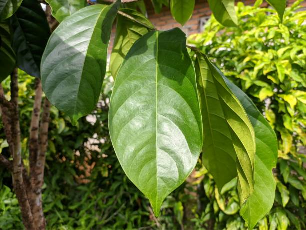

Lanzones is a tropical tree producing small round fruits. It has pinnate leaves and grows well in Southeast Asian climates.

---

### 8️⃣ Guava (*Psidium guajava*)
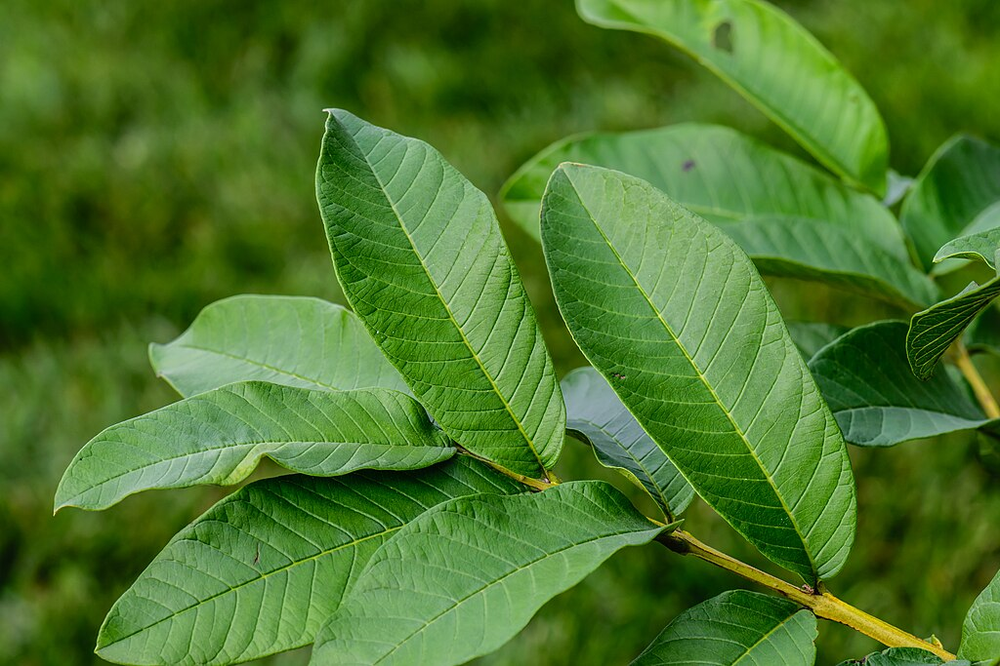

Guava is a small tropical tree with oval leaves and aromatic fruits. It is rich in vitamin C and commonly grown in tropical regions.

---

### 9️⃣ Cacao (*Theobroma cacao*)
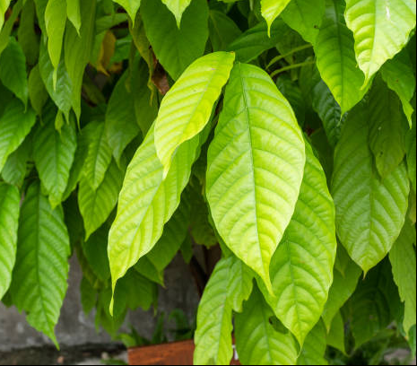

Cacao is the source of chocolate. It has broad, smooth leaves and grows best in tropical rainforests.

---

### 🔟 Neem (*Azadirachta indica*)

Neem is a medicinal tree known for its antibacterial and antifungal properties. It has compound leaves and is widely used in traditional medicine.

---

### 1️⃣1️⃣ Corn (*Zea mays*)

Corn is a staple agricultural crop with long narrow leaves and tall stalks. It is cultivated globally for food and industrial use.

---

### 1️⃣2️⃣ Sugarcane (*Saccharum officinarum*)
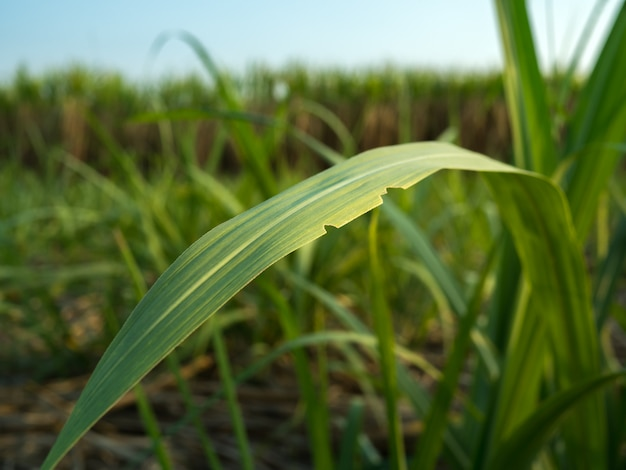

Sugarcane is a tall grass species used for sugar production. It has long, blade-like leaves and thick fibrous stalks.

---

### 1️⃣3️⃣ Betel (*Piper betle*)
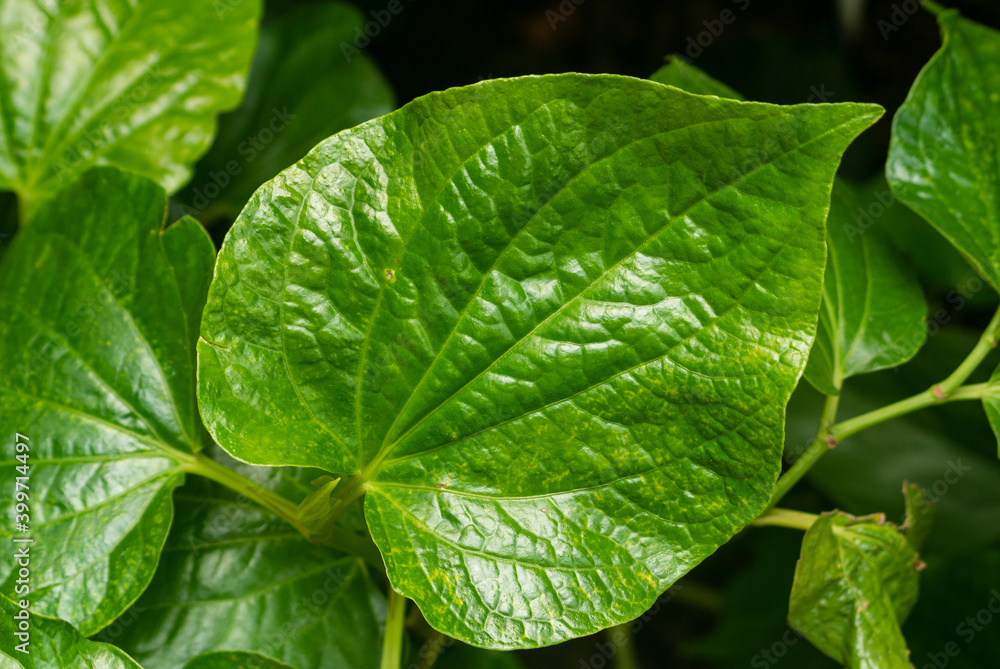

Betel is a vine plant with heart-shaped leaves. It is widely used in traditional practices and herbal medicine.

---

### 1️⃣4️⃣ Sweet Potato (*Ipomoea batatas*)
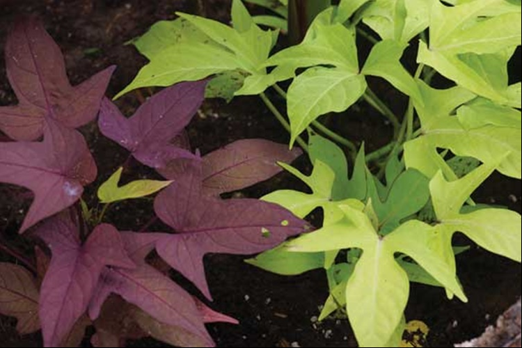

Sweet potato is a root crop plant with heart-shaped leaves. It is grown for its edible tuber rich in carbohydrates and vitamins.

---

### 1️⃣5️⃣ Cassava (*Manihot esculenta*)
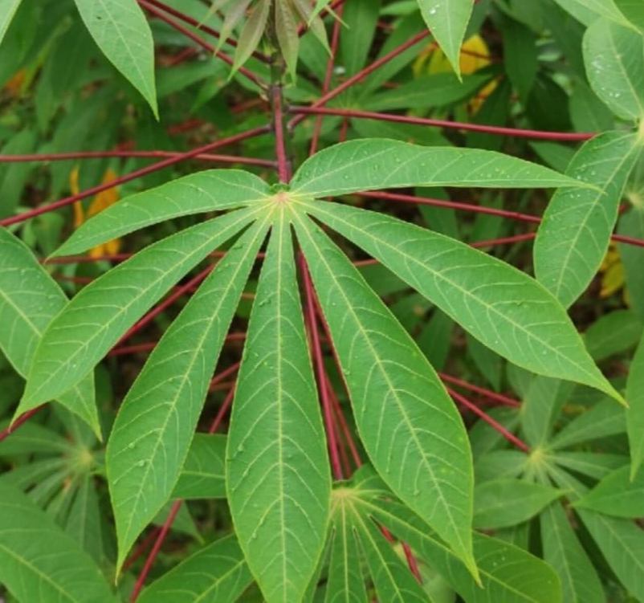

Cassava is a drought-resistant root crop with palm-like leaves. It is an important food source in tropical regions.

---

### 1️⃣6️⃣ Taro (*Colocasia esculenta*)
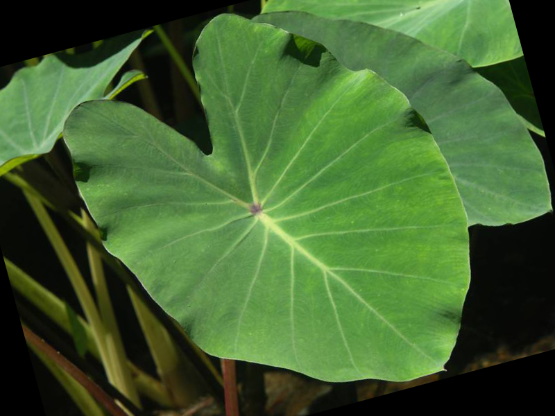

Taro is a tropical plant known for its large heart-shaped leaves. It is cultivated for its edible underground corm.

---

### 1️⃣7️⃣ Eggplant (*Solanum melongena*)
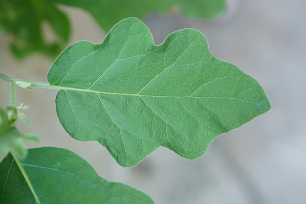

Eggplant is a vegetable plant with broad leaves and purple fruits. It belongs to the nightshade family.

---

### 1️⃣8️⃣ Narra (*Pterocarpus indicus*)

Narra is a hardwood tree native to Southeast Asia. It has compound leaves and is valued for its durable timber.

---

### 1️⃣9️⃣ Mahogany (*Swietenia macrophylla*)
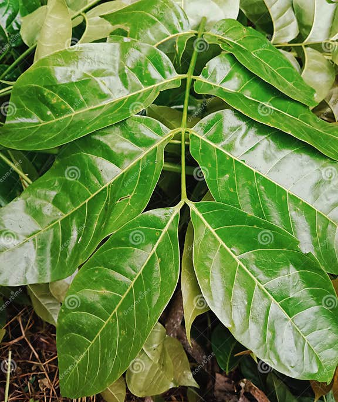

Mahogany is a large tropical tree known for its high-quality wood. It has pinnate leaves and is commonly used in furniture making.

---

### 2️⃣0️⃣ Avocado (*Persea americana*)
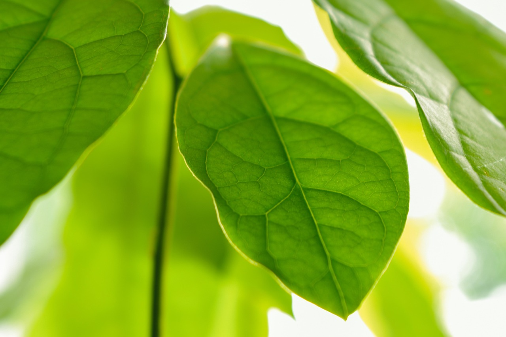

Avocado is a fruit-bearing tree with dark green oval leaves. It produces nutrient-rich fruits widely consumed worldwide.

---

## 📊 Dataset Information

- Total Classes: 20
- Images per Class: 250–300
- Total Images: ~5,000+
- Image Type: Leaf-based plant images
- Image Size: Default Teachable Machine preprocessing

---

## ⚙️ Model Training Details

- Epochs: 30
- Batch Size: 16
- Learning Rate: 0.001
- Validation Split: Default (Teachable Machine)

### 📸 Training Settings Screenshot

---

## 📈 Model Evaluation

### 🔍 Confusion Matrix

### 📊 Accuracy Per Class

### ✅ Overall Accuracy
(Write the percentage here, e.g., 89%)

---

## 🧪 Model Testing (Preview Section)

Below are 10 real-time prediction tests:

---

## 📦 Exported Model

The trained model was exported in:
- TensorFlow format
- Saved in the `exported_model/` folder

---

## 🧠 Reflection

### 1️⃣ How did the number of images affect accuracy?
Having 250–300 balanced images per class improved generalization and reduced bias.

### 2️⃣ Which plants were misclassified?
(Some species with similar leaf shapes were occasionally confused due to visual similarity.)

### 3️⃣ How did parameter changes affect training?
Increasing epochs improved accuracy until overfitting began. Batch size 16 gave stable training.

### 4️⃣ Challenges encountered
- Finding diverse, non-duplicate images
- Similar-looking plant species
- Cleaning mislabeled data

### 5️⃣ Future Improvements
- Add background removal
- Increase dataset diversity
- Use a more advanced CNN architecture
- Collect real-world field images

---

## 🚀 Tools Used
- Google Teachable Machine
- Google Drive
- GitHub
