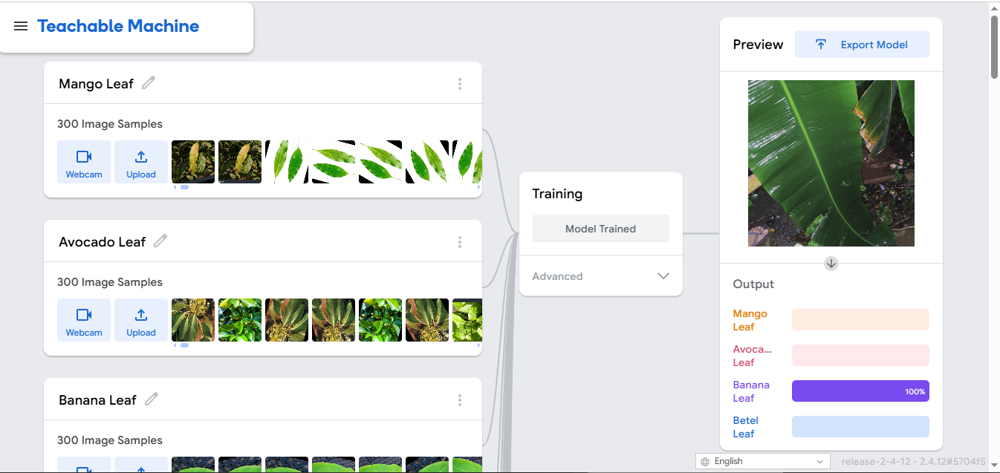
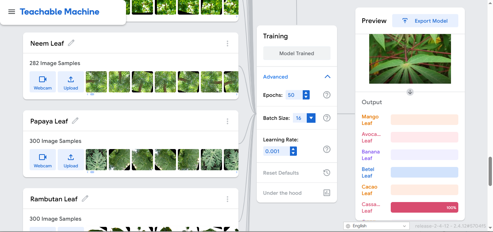
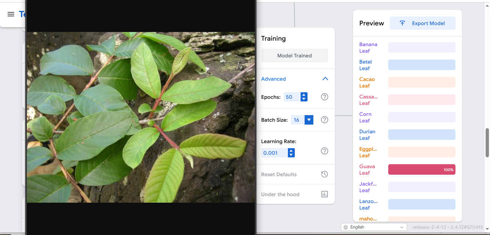
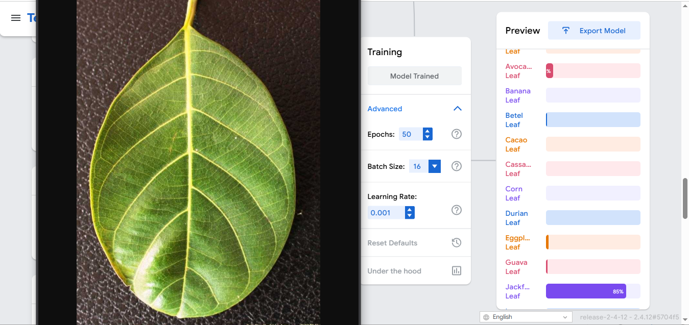
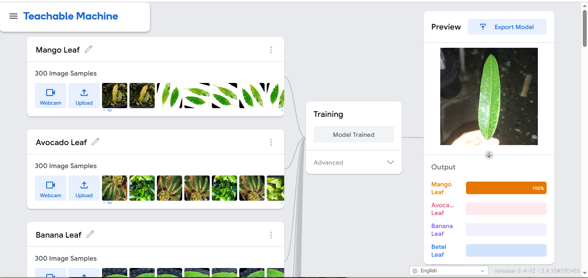
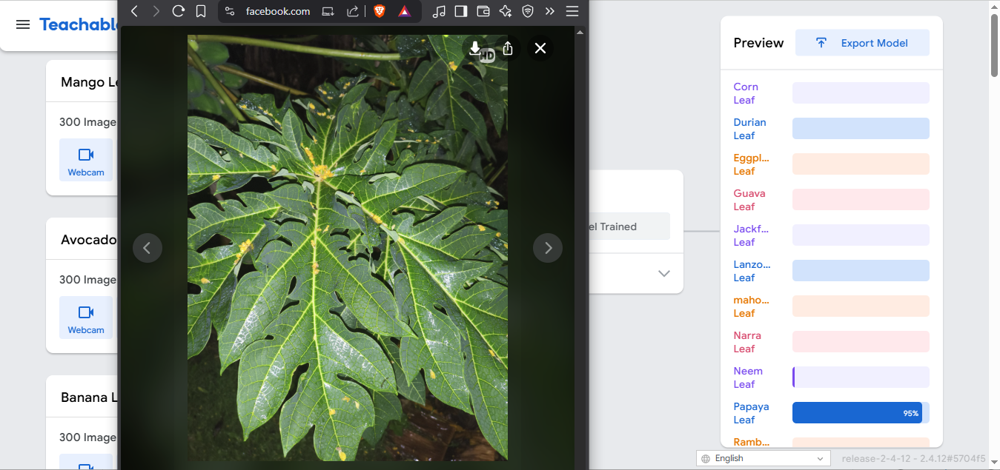
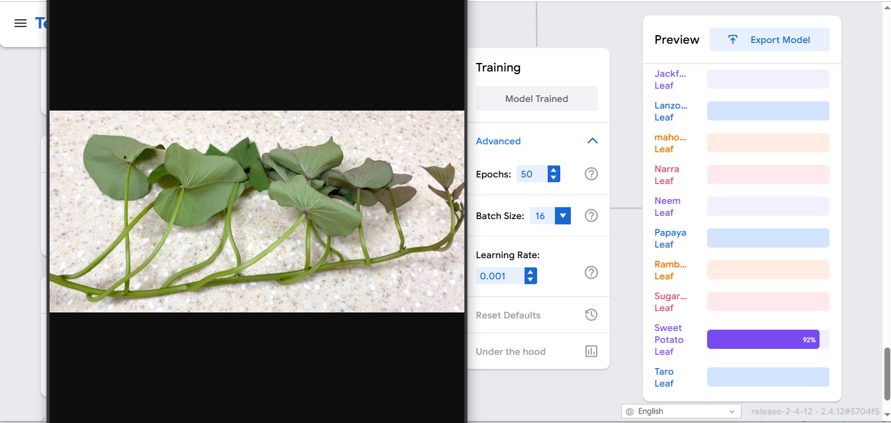
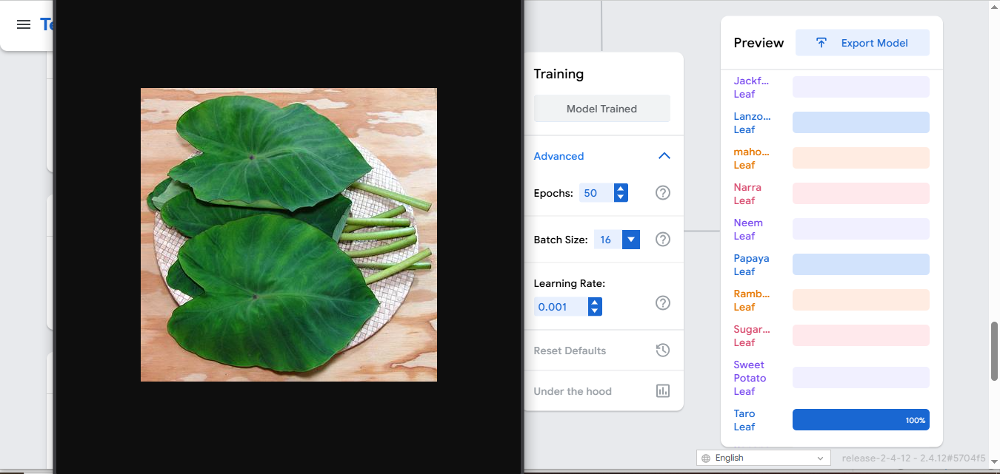

# 🌿 Plant Species Image Classification

### 📌 A. Project Overview 
This project aims to develop an image classification model that can recognize and differentiate 20 related plant species using Google Teachable Machine. A dataset of at least 250 images per species was collected, focusing primarily on leaf-based images captured from different angles and lighting conditions to improve model accuracy and generalization.

The purpose of this model is to automatically identify plant species based on visual features such as leaf shape, vein structure, texture, and overall appearance. This demonstrates how machine learning can be applied to real-world problems in agriculture, environmental monitoring, and plant identification, while showcasing the process of dataset preparation, model training, evaluation, and deployment.

#
### 🌱  B. LEAF-BASED NON-SUCCULENT PLANT Species List

### 1. Mango (*Mangifera indica*)

Mango leaves are long, narrow, and lance-shaped with smooth edges. They are glossy dark green when mature and have a prominent central vein.

#

### 2. Banana (*Musa acuminata*)

Banana leaves are large, elongated, and paddle-shaped with parallel venation. They have a smooth texture and often tear naturally along the veins.

#

### 3. Papaya (*Carica papaya*)

Papaya leaves are large and deeply lobed with a palmate structure. They grow on long hollow petioles and have prominent radiating veins.

#

### 4. Jackfruit (*Artocarpus heterophyllus*)

Jackfruit leaves are thick, oval-shaped, and leathery with smooth margins. They have a glossy dark green surface and a short pointed tip.

#

### 5. Durian (*Durio zibethinus*)

Durian leaves are oblong and elongated with smooth edges. The upper surface is glossy green, while the underside has a golden-brown tint.

#

### 6. Rambutan (*Nephelium lappaceum*)

Rambutan leaves are compound with multiple leaflets. Each leaflet is oval-shaped, smooth-edged, and has a slightly leathery texture.

#

### 7. Lanzones (*Lansium parasiticum*)

Lanzones leaves are pinnate and consist of several oval leaflets arranged along a central stem. The leaflets are smooth and dark green.

#

### 8. Guava (*Psidium guajava*)

Guava leaves are oval-shaped with noticeable parallel veins. They have a slightly rough texture and a dull green surface.

#

### 9. Cacao (*Theobroma cacao*)

Cacao leaves are broad, smooth, and elongated with entire margins. Young leaves are reddish before turning glossy green as they mature.

#

### 10. Neem (*Azadirachta indica*)

Neem leaves are compound and made up of several serrated leaflets. The leaflets are narrow, pointed, and bright green.

#

### 11. Corn (*Zea mays*)

Corn leaves are long, narrow, and blade-like with parallel veins. They grow alternately along the stalk and have smooth edges.

#

### 12. Sugarcane (*Saccharum officinarum*)

Sugarcane leaves are long and linear with sharp edges and parallel venation. They are attached to thick fibrous stalks.

#

### 13. Betel (*Piper betle*)

Betel leaves are heart-shaped with smooth edges and a glossy surface. They have distinct branching veins.

#

### 14. Sweet Potato (*Ipomoea batatas*)

Sweet potato leaves are heart-shaped or slightly lobed with smooth margins. They have soft textures and visible veins.

#

### 15. Cassava (*Manihot esculenta*)

Cassava leaves are palmately lobed with multiple narrow segments. They are smooth-edged and grow on long petioles.

#

### 16. Taro (*Colocasia esculenta*)

Taro leaves are large, heart-shaped, and have a waxy surface. The veins radiate outward from a central point.

#

### 17. Eggplant (*Solanum melongena*)

Eggplant leaves are broad and slightly lobed with soft hairs. They have a rough texture and visible midrib.

#

### 18. Narra (*Pterocarpus indicus*)

Narra leaves are compound with several oval leaflets. The leaflets are smooth, rounded at the tip, and arranged alternately.

#

### 19. Mahogany (*Swietenia macrophylla*)

Mahogany leaves are pinnate and composed of paired leaflets. The leaflets are smooth-edged and elliptical in shape.

#

### 20. Avocado (*Persea americana*)

Avocado leaves are oval to elliptical with smooth margins. They are dark green, slightly leathery, and have a prominent central vein.

#

## ⚙️ C. Model Training Details

- Epochs: 50
- Batch Size: 16
- Learning Rate: 0.001
- Number of images per class: 250-300

### 📸 Training Settings Screenshot

I used this settings because it is the default and it is much safer.
#

## 📈 D. Model Evaluation

<table>
<tr>
<td align="center">
 
<b>Accuracy per Epoch</b>
</td>
<td align="center">
 
<b>Loss per Epoch</b>
</td>
</tr>

<tr>
<td align="center">
 
<b>Accuracy per Class</b>
</td>
<td align="center">
 
<b>Confusion Matrix</b>
</td>
</tr>
</table>

## 🧪 E. Model Testing (Preview Section)

| Test 1 – Banana | Test 2 – Cassava | Test 3 – Guava | Test 4 – Jackfruit | Test 5 – Lanzones |
|-----------------|-----------------|----------------|------------------|------------------|
|  |  |  |  |  |

| Test 6 – Mango | Test 7 – Neem | Test 8 – Papaya | Test 9 – Sweet Potato | Test 10 – Taro |
|----------------|---------------|----------------|---------------------|----------------|
|  |  |  |  |  |
#

## Reflection

### 1️⃣ How did the number of images affect accuracy?
Having 250–300 balanced images per class improved generalization and reduced bias.

### 2️⃣ Which plants were misclassified?
Some species with similar leaf shapes were occasionally confused due to visual similarity like corn and sugarcane.

### 3️⃣ How did parameter changes affect training?
Increasing epochs improved accuracy until overfitting began. Batch size 16 gave stable training.

### 4️⃣ Challenges encountered
- Finding diverse, non-duplicate images, more images
- Similar-looking plant species
- Cleaning mislabeled data

### 5️⃣ Future Improvements
- Add background removal
- Increase dataset diversity
- Use a more advanced CNN architecture
- Collect real-world field images

